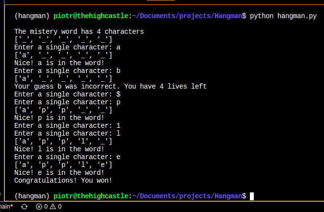

# Hangman

This is an implementation of the game of **Hangman**, submitted as a part of 
[AiCore](https://www.theaicore.com/) training.  

## Rules of the game

- Your objective is to guess a *magick word*
- To do so you need to guess the letters it contains
- If your guess is **correct** the game indicates all the positions of this letter in the *magick word*
- If your guess is **incorrect** you loose a *life*
- If what you provide is *not* a letter, the game will ask you again
- You have 5 lives
- The game ends when you either guess the *magick word* correctly, or run out of lives.

 

## Playing the game
